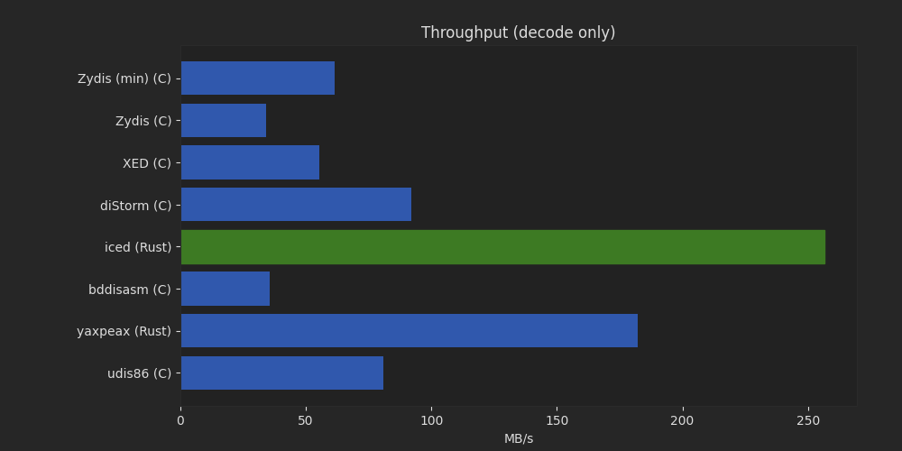

Disassembler Benchmark
======================

This repository holds benchmarking code for various x86/x86-64 disassembler libraries.

## Results

Windows 10, msvc 19.29, Rust 1.52.1, i5-6600K.

Test file: xul.dll from Firefox 86.0.1.7739 (77MB code section).

# decode only



Library | MB/s | %
--------|------|--
iced (Rust) | 257.07 MB/s | 100.00%
yaxpeax (Rust) | 177.55 MB/s | 69.07%
diStorm (C) | 79.95 MB/s | 31.10%
udis86 (C) | 70.35 MB/s | 27.37%
Zydis (min) (C) | 51.99 MB/s | 20.22%
XED (C) | 43.45 MB/s | 16.90%
bddisasm (C) | 33.69 MB/s | 13.10%
Zydis (C) | 27.96 MB/s | 10.88%

`BeaEngine (C)`, `Capstone (C)` don't support `decode only`.


# decode + format


Library | MB/s | %
--------|------|--
iced (Rust) | 135.71 MB/s | 100.00%
diStorm (C) | 51.66 MB/s | 38.07%
yaxpeax (Rust) | 36.71 MB/s | 27.05%
Zydis (C) | 18.62 MB/s | 13.72%
BeaEngine (C) | 14.65 MB/s | 10.79%
bddisasm (C) | 13.69 MB/s | 10.09%
udis86 (C) | 12.00 MB/s | 8.84%
Capstone (C) | 11.21 MB/s | 8.26%
XED (C) | 11.18 MB/s | 8.24%


## Candidates

[Capstone](https://github.com/aquynh/capstone)

[DiStorm](https://github.com/gdabah/distorm)

[XED](https://github.com/intelxed/xed)

[Zydis](https://github.com/zyantific/zydis)

[iced](https://github.com/icedland/iced)

[bddisasm](https://github.com/bitdefender/bddisasm)

[yaxpeax-x86](https://github.com/iximeow/yaxpeax-x86)

[udis86](https://github.com/vmt/udis86)

[BeaEngine](https://github.com/BeaEngine/beaengine)

## Benchmarking

Windows:

```cmd
REM Start "x64 Native Tools Command Prompt for VS 2019"
REM Start git bash:
"C:\Program Files\Git\bin\bash.exe"
```

Windows/Linux/macOS:

```bash
git clone --recursive 'https://github.com/icedland/disas-bench.git'
cd disas-bench.git
./make-all.sh
# Windows: python
python3 -mvenv venv
# Windows: source venv/Scripts/activate
source venv/bin/activate
pip install -r requirements.txt
# Optional args: <code-offset> <code-len> <filename> [loop-count]
python bench.py
```

The optional `bench.py` arguments are:

- `<code-offset>` = offset of the code section (in decimal or 0x hex)
- `<code-len>` = length of the code section (in decimal or 0x hex)
- `<filename>` = 64-bit x86 binary file to decode and format
- `[loop-count]` = optional loop count. Total number of bytes decoded and formatted is `<code-len> * [loop-count]`

You can use `dumpbin.exe` (Windows) or `objdump` to get the offset and size of the code section.

### dumpbin (start "x64 Native Tools Command Prompt for VS 2019")

Find `.text` section and use `<code-len> = virtual size` (`4CFA6B6` below) and `<code-offset> = file pointer to raw data` (`400` below). All values are in hex so add a 0x prefix when passing the values to `bench.py`.

```text
C:\path> dumpbin -headers filename.dll

...
SECTION HEADER #1
   .text name
 4CFA6B6 virtual size
    1000 virtual address (0000000180001000 to 0000000184CFB6B5)
 4CFA800 size of raw data
     400 file pointer to raw data (00000400 to 04CFABFF)
...
```

### objdump

Find `.text` section and set `<code-len>` to the first 32-bit value (`04cfa6b6` below) and `<code-offset>` to the last 32-bit value (`00000400` below). All values are in hex so add a 0x prefix when passing the values to `bench.py`.

```text
$ objdump -h filename

...
Sections:
Idx Name          Size      VMA               LMA               File off  Algn
  0 .text         04cfa6b6  0000000180001000  0000000180001000  00000400  2**4
                  CONTENTS, ALLOC, LOAD, READONLY, CODE
...
```

## Contributing

If you feel like the benchmark for a lib doesn't drive it to its full potential or treats it unfairly, I'd be happy to accept PRs with improvements!
